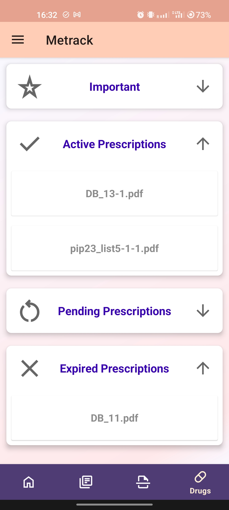

# Metrack

Metrack is a user-friendly application designed to help users track their medical documents. It provides a simple and efficient way to manage and organize important prescriptions, active prescriptions, pending prescriptions, and expired prescriptions or anything else.

  
First activities demonstration and navigation drawer although

After login or registration(which is also way to log in) there are 4 activities
   
## Features

- **Document Scanning**: Metrack allows users to scan their medical documents directly from the app. The scanned documents are then converted into PDF format for easy storage and retrieval. Users can input a name for the scanned document before scanning it, and if no name is provided, the document will be stored under the name "NoFileName".

- **Document Upload**: Users can also upload existing PDF files from their device. This feature supports all PDF files, making it easy to import and manage your documents.

- **Document Categorization**: Metrack provides a categorization feature that allows users to categorize their documents into different categories such as Important Prescriptions, Active Prescriptions, Pending Prescriptions, and Expired Prescriptions. This feature helps users to organize their documents better and find them quickly when needed.

- **Firebase Integration**: Metrack uses Firebase for secure storage and retrieval of user documents. All scanned and uploaded documents are stored in Firebase, ensuring they are safe and accessible from any device.

## How to Use

1. **Scanning a Document**: To scan a document, click on the scan button. This will open the document scanner. Before scanning, you can enter a file name in the provided EditText field. If no name is provided, the document will be stored under the name "NoFileName". After scanning, the document will be uploaded to Firebase and stored under the entered file name.

2. **Uploading a Document**: To upload a document, click on the upload button and select the PDF file you want to upload. After selecting, you can enter a file name and choose a category for your document. The document will then be uploaded to Firebase and stored under the entered file name.

## Requirements

- Android Studio Hedgehog | 2023.1.1 Patch 2 or later
- Firebase account

## Installation

1. Clone the repository to your local machine.
2. Open the project in Android Studio.
3. Connect the app to your Firebase account.
4. Run the app on your device or emulator.

## Author

it.illushka